# School_District_Analysis
--- 
## Project Overview 

This project analyses data of from a local district, in order to gain insight into performance trends and patterns, to help the school district implement strategic decisions for the schools at a district level. However, after the project was started, it was stated that some 9th grade maths and reading scores, in Thomas High School, showed academic dishonesty, so the data was reworked to replace those school grades with NaNs, while keeping the rest of the data intact. 

This paper will prepare all standardized tests, looking at reading and writing scores, as well as budget information to help with this analysis. It will then compare the original data with the new data with the removed grades, to see how these changes affected the overall analysis. 

## Aim

-	How is the district summary affected by NaNs
-	 How is the school summary affected by NaNs
-	How does replacing the ninth graders’ maths and reading scores affect Thomas High School’s performance relative to the other schools?
-	How does replacing the ninth-grade scores affect the following:
    -	Maths and reading scores by grade
    - Scores by school spending
    - Scores by school size
    - Scores by school type

---

## Analysis and Results 
---
### School District Analysis 

 

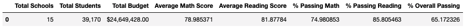
Old District Analysis

 

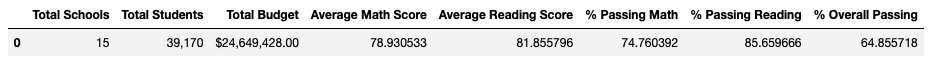
New District Analysis

 

When assessing average scores and passing percentages among the 15 high schools in the school district, the average maths score dropped 0.05, the average reading score dropped 0.02, the percentage passing maths dropped 0.22%, the percentage passing reading dropped 0.12%, and the overall passing percent dropped 0.32%.

---
### School Summary Analysis 

 

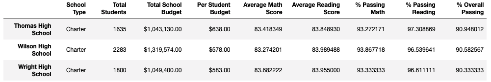
Old School Summary

 

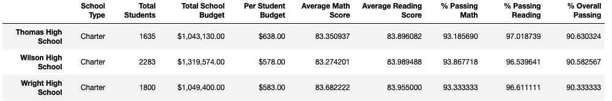
New School Summary

 

Though there's not a significant difference in the overall school district data, Thomas High School can be analysised individually to see the effects of the grade changes. The average maths score dropped 0.07, the average reading score increased 0.05, the percentage passing maths dropped 0.09%, the percentage passing reading dropped 0.3%, and the overall passing percent dropped 0.32%.

---
### Thomas High School Relative Performance 

 

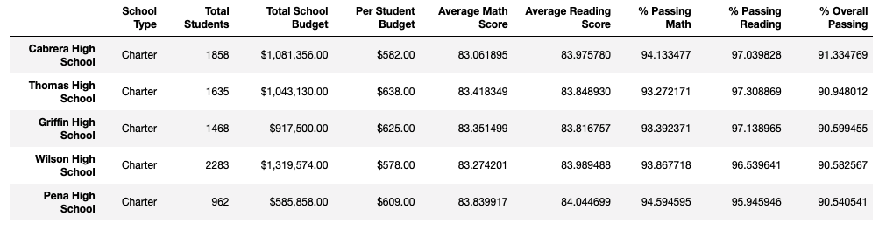
Old Top Performing Schools

 

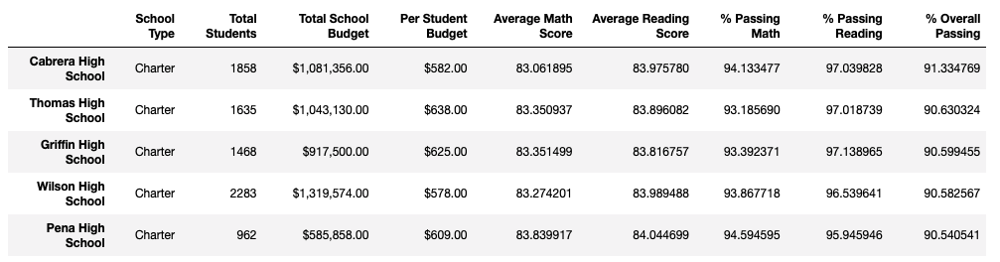
New Top Performing Schools

 

When looking at the top performing schools, even with the dishonest grades taken out, there is no change in Thomas High Schools overall position. 

---
### Math and Reading Score by Grade

 

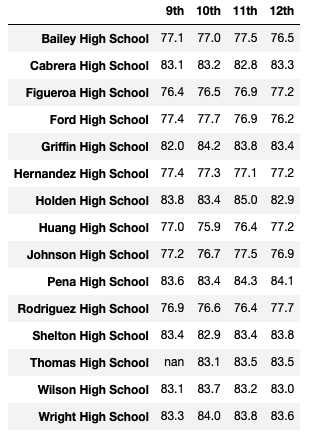
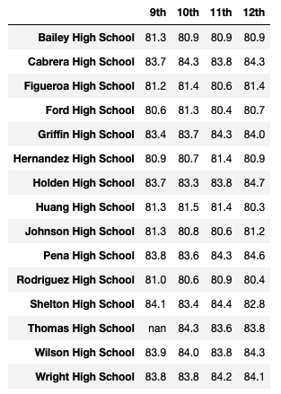

New Maths Scores by Grade &nbsp; &nbsp; &nbsp; &nbsp; &nbsp; &nbsp; &nbsp; &nbsp; &nbsp; &nbsp; &nbsp; &nbsp; &nbsp; &nbsp; &nbsp; New Reading Scores by Grade

 

When looking at maths and reading score by grade, it is shown that the 9th grade results for Thomas High School, for both reading and maths, have been replaced by 'NaN', while leaving all other scores the same. 

---
### Scores by School Spending

 

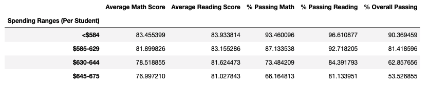
Old Scores by School Spending

 

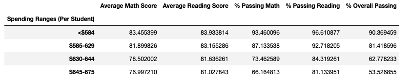
New Scores by School Spending

 

As Thomas High School fell into the "$630-644" bracket, there is only a slight change in that spending range row. Average maths scores dropped 0.02, average reading increased 0.02, the percentage passing maths dropped 0.02%, the percentage passing reading dropped 0.07%, and the overall passing percent dropped 0.08%.

---
### Scores by School Size

 

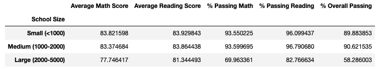
Old Scores by School Size

 

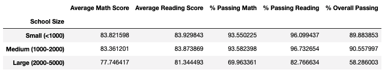
New Scores by School Size

 

As Thomas High School fell into the "Medium (1000-2000)" bracket, there is only a slight change in that school size row. Average maths scores dropped 0.01, average reading increased 0.01, the percentage passing maths dropped 0.02%, the percentage passing reading dropped 0.06%, and the overall passing percent dropped 0.06%.

---
### Scores by School Type

 

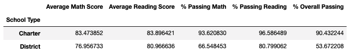
Old Scores by School Type

 

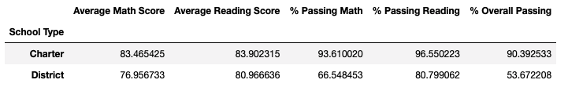
New Scores by School Type

 

As Thomas High School is a "Charter" school, there is only a slight change in that school type row. Average maths scores dropped 0.008, average reading increased 0.006, the percentage passing maths dropped 0.01%, the percentage passing reading dropped 0.04%, and the overall passing percent dropped 0.04%.

---
## Summary

It is evident from this analysis that replacing Thomas High Schools (THS) 9th grade maths and reading scores, with NaNs, changed the school district analysis. 

THS saw a decrease in all metrics, bar Average Reading Score, which in turn, caused all the metrics (bar Average Reading Score), for the district to fall. However, the decrease in score was not significant enough to change THS relative performance to other schools in the district. 

Additionally, the spending bracket THS is in, $630-644, saw a decrease in all metrics, bar Average Reading Score. THS also fell into the medium school bracket, 1000-2000, and that bracket saw a decrease in all metrics, bar Average Reading Score. Lastly, when looking at performance by school type, the charter school, which THS is one of, saw a decrease in all metrics, bar Average Reading Score. 

